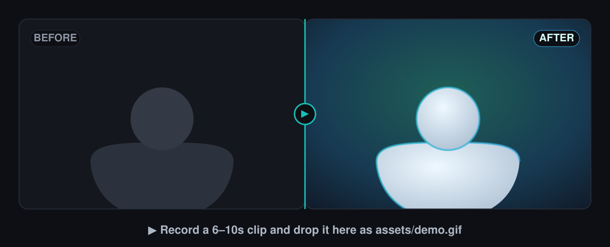

<div align="center">



<br>

**NVIDIA Broadcast, rebuilt for Linux** — GPU background blur & replacement with
**film-quality edges** (real alpha matting, not a cheap cut-out), an AI **Studio
Light** that fixes bad room lighting, and **RTX-Voice-style mic denoise** — served
to Zoom, Meet, OBS, Discord and anything else as a normal webcam + microphone.

<br>

[](https://github.com/kaiserkonok/nvidia_broadcast_linux/stargazers)
[](https://github.com/kaiserkonok/nvidia_broadcast_linux/network/members)
[](https://github.com/kaiserkonok/nvidia_broadcast_linux/commits/master)


**[Install](#-install) · [Features](#-features) · [How it looks real](#-how-it-looks-real) · [Usage](#️-usage) · [Requirements](#-requirements) · [Roadmap](#️-roadmap)**

</div>

<br>

<div align="center">

<!--
  ★ THE #1 THING THAT WINS STARS: a real demo.
  Record a 6–10s clip (raw webcam → blur → replaced bg, turning your head so the
  edges show; then toggle mic denoise), export it as assets/demo.gif, and swap the
  line below for:   
-->


</div>

<br>

## ⚡ Install

```bash
curl -fsSL https://raw.githubusercontent.com/kaiserkonok/nvidia_broadcast_linux/master/install.sh | bash
```

One command. It installs everything, adds **NVBroadcast** to your app menu, and
sets up the virtual camera. Launch it, pick a background, and select **“Broadcast
Virtual Camera”** in your video app.

```bash
nvbroadcast            # launch    (or open “NVBroadcast” from your apps)
nvbroadcast update     # fast git-pull update, no re-download
nvbroadcast uninstall  # clean removal
```

<br>

## ✨ Features

|  | Feature | What it does |
|:-:|:--|:--|
| 🪄 | **Blur · Replace · Color** | Switch background live — blur, any image, or a solid color. No restart. |
| 🧠 | **Real edges, not a cut-out** | Per-pixel **alpha matting** (RVM / BiRefNet) keeps individual hairs and soft motion, and **decontaminates** background color spill so you don't look pasted on. |
| 💡 | **Studio Light** | AI auto-relight fixes bad room lighting on your **face** — auto-exposure, white-balance and contrast — in **every** mode, even with no background change. |
| 🎨 | **Scene light matching** | On replaced backgrounds, the subject adopts the scene's white balance & exposure + light-wrap, so you look *lit by* the scene, not glued onto it. |
| 🎯 | **Auto-Frame** | Smoothly pans & zooms to keep you centered — driven off the matte, no extra model. |
| 🎞️ | **Camera-match finishing** | Lens depth-of-field, matched sensor grain, and vignette so subject + background read as **one camera**. |
| 🎙️ | **Mic noise removal** | RTX-Voice-style denoise (**DeepFilterNet**) as a virtual mic — kills keyboard, fan & room noise, keeps your voice natural. |
| 🏆 | **Fast / Best / Ultra** | Quality tiers: MobileNetV3 · **RVM ResNet-50** (real-time) · **BiRefNet** (SOTA masks). |
| 🖥️ | **Native desktop app** | Live preview, system-tray icon (closes to tray), remembers your settings. |
| 🔌 | **Works everywhere** | Appears as a normal V4L2 webcam **and** virtual mic in OBS, Zoom, Meet, Discord, browsers… |
| 🛠️ | **Self-configuring** | Sets up the `v4l2loopback` virtual camera for you — graphical password prompt only when it truly needs one. |

<br>

## 🆚 vs. NVIDIA Broadcast

| | NVIDIA Broadcast | **NVBroadcast (Linux)** |
|:--|:-:|:-:|
| **Runs on Linux** | ❌ Windows only | ✅ |
| Background blur / replace | ✅ | ✅ **alpha matting** |
| Soft hair-level edges | ✅ | ✅ |
| Auto face relight | ❌ | ✅ **Studio Light** |
| Scene light / color match | ❌ | ✅ |
| Auto-Frame | ✅ | ✅ |
| Mic noise removal | ✅ | ✅ DeepFilterNet |
| Virtual cam in any app | ✅ | ✅ |
| **Open source** | ❌ | ✅ GPL-3.0 |
| Price | Free (RTX) | Free |

<br>

## 🔬 How it looks real

Cheap “virtual backgrounds” use a binary person/background **mask** → hard, jagged
edges and chewed-off hair. NVBroadcast uses **video matting**:

1. **Alpha, not a mask** — each pixel gets an opacity `0.0–1.0`, so hair strands and soft edges blend naturally.
2. **Foreground decontamination** — the model estimates your true foreground color separately, removing the background halo around your edges.
3. **Temporal stability** — a recurrent model keeps the matte steady frame-to-frame instead of shimmering.
4. **Realism finishing** — scene color/exposure match, light-wrap, feathering, lens defocus, matched grain — the details that sell it as one camera.

Powered by [Robust Video Matting](https://github.com/PeterL1n/RobustVideoMatting) and [BiRefNet](https://github.com/ZhengPeng7/BiRefNet), composited on the GPU.

> 💡 **Studio Light** was born from this pipeline: the same GPU grading that matches
> your subject to a scene turns out to *rescue a dark, badly-lit room* — so it's now
> a one-click toggle that works in **every** mode, background or not.

<br>

## 🖥️ Usage

Open **NVBroadcast** from your app menu (or run `nvbroadcast`):

- **Start / Stop Camera** — your webcam is used only while active.
- **Background** — Off · Blur (with strength) · Color · Image.
- **Enhance** — Photoreal edges · **Studio Light** (+ intensity) · Auto-Frame · Vignette.
- **Quality** — Fast · Best · Ultra.
- **Remove background noise** — flip it on, then pick **“NVBroadcast Microphone”** in your call app.
- Close the window to tuck it into the **tray**; **Quit** from the tray to exit.

Then in OBS / Zoom / Meet / Discord, choose **“Broadcast Virtual Camera.”**
In OBS: *Sources → Video Capture Device (V4L2) → Broadcast Virtual Camera* (start NVBroadcast **before** OBS).

<br>

## 📦 Requirements

| | Minimum | Recommended |
|:--|:--|:--|
| **GPU** | NVIDIA **RTX**, ~4 GB VRAM | RTX with 6–8 GB VRAM (for **Ultra**) |
| **Driver** | CUDA 12.8-capable (recent NVIDIA driver) | — |
| **RAM** | 8 GB | 16 GB |
| **Webcam** | any UVC / MJPG webcam | 1080p |
| **Disk** | ~3.5 GB (PyTorch + CUDA runtime) | +0.9 GB if you use Ultra |
| **OS** | Linux, `apt`-based (Debian/Ubuntu) for the 1-command installer | Ubuntu 24.04 / GNOME (tested) |

The video pipeline is GPU-resident (matting + compositing in CUDA fp16); mic denoise
runs on CPU via PipeWire. Non-`apt` distros: install `v4l2loopback-dkms`, `v4l-utils`,
`python3-venv` and run `scripts/run_app.sh`.

<br>

## 🗺️ Roadmap

- [x] Real-time background matting (blur / image / color)
- [x] Native desktop app + system tray + saved settings
- [x] One-command install / update / uninstall
- [x] Realism pass — scene color/exposure match, light-wrap, edge feathering
- [x] **Studio Light** — AI subject relight in every mode
- [x] Auto-Frame — smooth pan/zoom keeps you centered
- [x] Fast / Best / **Ultra** matting tiers (MobileNetV3 · RVM ResNet-50 · BiRefNet)
- [x] Camera-match finishing — depth-of-field, matched grain, vignette
- [x] Mic denoise — RTX-Voice-style noise removal (DeepFilterNet) → virtual mic
- [ ] Eye-contact / gaze correction
- [ ] TensorRT engine for even lower latency
- [ ] Video (webcam) denoise & low-light enhancement

<br>

## 🙏 Credits & License

- Matting: [Robust Video Matting](https://github.com/PeterL1n/RobustVideoMatting) (Peter Lin et al.) · [BiRefNet](https://github.com/ZhengPeng7/BiRefNet) (Zheng Peng et al.)
- Denoise: [DeepFilterNet](https://github.com/Rikorose/DeepFilterNet)
- Plumbing: [v4l2loopback](https://github.com/umlaeute/v4l2loopback) · [pyvirtualcam](https://github.com/letmaik/pyvirtualcam) · [PipeWire](https://pipewire.org)

Licensed under **GPL-3.0** (the vendored matting model is GPL-3.0). See [LICENSE](LICENSE).

<br>

<div align="center">

### ⭐ If NVBroadcast makes your calls look better, drop a star — it genuinely helps.

<a href="https://star-history.com/#kaiserkonok/nvidia_broadcast_linux&Date">
  
</a>

<sub>Built from scratch for Linux. Not affiliated with NVIDIA.</sub>

</div>
